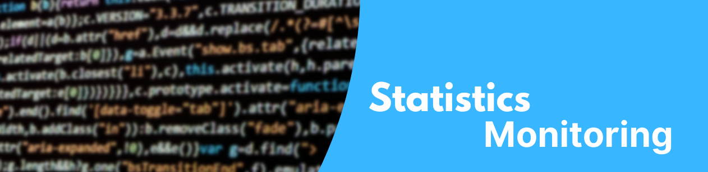
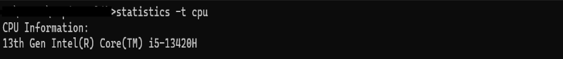
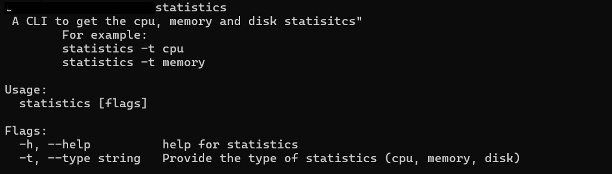

# statistics-cli



Statistics CLI is build using the Cobra to determine the machine statisitics like CPU, Memory, RAM.

# Commands

```
statistics -t cpu
```

Type can be provided using the -t command.




# Help-Command




